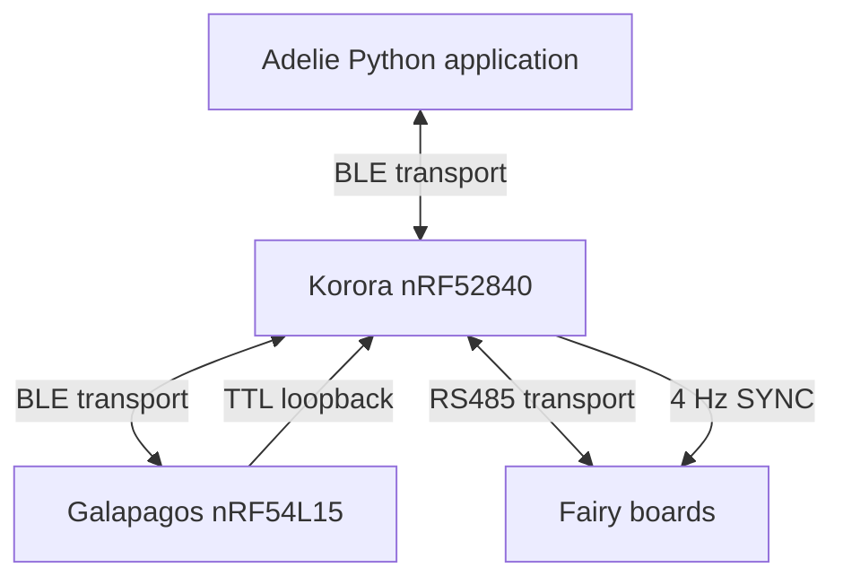

# Korora Fairy system

This project contains contains firmware for one Korora, one Galapagos, and a configurable number of Fairy boards. It also contains the Adelie Python application and the shared wire protocol library.

The default maximum is six Fairy boards. Change `FAIRY_MAX_BOARDS` in `shared/include/fairy_shared/system_config.hpp` or pass it as a build definition.

## Naming conventions

| Implementation name | Role                  | Board       |
| ------------------- | --------------------- | ----------- |
| Korora              | Floating platform hub | nRF52840    |
| Fairy               | Reward port           | STM32G071\* |
| Galapagos           | Static DAQ TTL sync   | nRF54L15    |

| Protocol name      | Layer       | Use                                                                                             |
| ------------------ | ----------- | ----------------------------------------------------------------------------------------------- |
| Fairy protocol     | Application | Defines structure of records that are collected and used for later analysis                     |
| Adelie protocol    | Application | Defines structure of commands being issued for interaction with peripherals, generating TTLs... |
| Magellan protocol  | Application | Defines process and structure of assinging logical addresses to fairy boards                    |
| Transport protocol | Transport   | Defines the structure of frames being sent over various media (UART, BLE)                       |

## System structure



Korora is the time authority and the only RS485 bus master. Galapagos creates scheduled TTL pulses. Fairy boards capture light gate and SYNC edges and drive the local outputs. Adelie assigns board names, sends commands, displays live quality, and writes experiment records.

All machine data uses one of these application protocols:

- Fairy v3 for records
- Adelie v2 for commands and responses
- Magellan v1 for discovery and address assignment

The application messages always use Transport v1 on BLE or RS485. Human debug text is isolated in each `debug_log` module and is never parsed by the system.

## Folders

| Folder      | Purpose                                                         |
| ----------- | --------------------------------------------------------------- |
| `shared`    | C++ transport, protocol, clock, queue, and byte utilities       |
| `korora`    | Zephyr firmware for the nRF52840 hub                            |
| `galapagos` | Zephyr firmware for the nRF54L15 TTL board                      |
| `fairy`     | STM32Cube and PlatformIO firmware for STM32G071 boards          |
| `adelie`    | Python 3.14 control, recording, parsing, analysis, and plotting |
| `docs`      | Wire protocol specifications and operating rules                |

## Fixed timing values

| Setting               |                              Value |
| --------------------- | ---------------------------------: |
| Common timestamp rate |          16000000 ticks per second |
| SYNC rate             |                               4 Hz |
| RS485 baud            |                             460800 |
| RS485 format          | 8 data bits, no parity, 1 stop bit |
| Fairy TIM2 rate       |                             16 MHz |
| Prototype VLOAD       |                            5000 mV |

One timer tick is 62.5 ns.

## Build summary

Use a current Zephyr or nRF Connect SDK workspace for the Nordic firmware.

```bash
west build -p always -b nrf52840dk/nrf52840 korora
west flash
```

```bash
west build -p always -b nrf54l15dk/nrf54l15/cpuapp galapagos
west flash
```

Build the prototype Fairy firmware with PlatformIO.

```bash
pio run -d fairy -e nucleo_g071rb_auto_rs485
pio run -d fairy -e nucleo_g071rb_auto_rs485 -t upload
```

Install Adelie in a Python 3.14 virtual environment.

```bash
cd adelie
python -m venv .venv
python -m pip install -e .
adelie
```

## Initial setup

1. Power Korora, Galapagos, and all Fairy boards
2. Start Adelie and connect to Korora
3. Wait for the complete UUID inventory
4. Use White LED to identify each board
5. Give each UUID a unique zero based Fairy index
6. Save the exact configuration
7. Wait for every clock model to become valid
8. Choose a new `.log` path
9. Press Record Start

Adelie applies saved assignments automatically only when the complete discovered UUID set exactly matches the saved set. A missing, added, or replaced board returns the user to configuration.

## Run behavior

Korora starts discovery, health checks, RS485 polling, and SYNC without Adelie. It does not save experiment data.

Record Start creates a session on every board. An unexpected Adelie disconnect ends that session and turns controlled outputs safe. Discovery, SYNC, and health work continue until power is removed.

A Fairy communication timeout or a Galapagos disconnect also ends the complete session. The fault is sent to Adelie before the remaining boards are stopped.

Critical records are always forwarded. Standard mode adds health and clock quality. Full mode adds raw SYNC observations and clock pairs.

## Safety

The valve starts off and has a hard 250 ms maximum time. It rejects overlap and enforces a minimum interval. RGB, IR, audio, and valve outputs enter safe states on reset and session stop. Audio has a 10 ms onset and offset ramp. The prototype configuration assumes automatic RS485 direction control. Korora and the Nucleo profile do not drive a direction GPIO.
